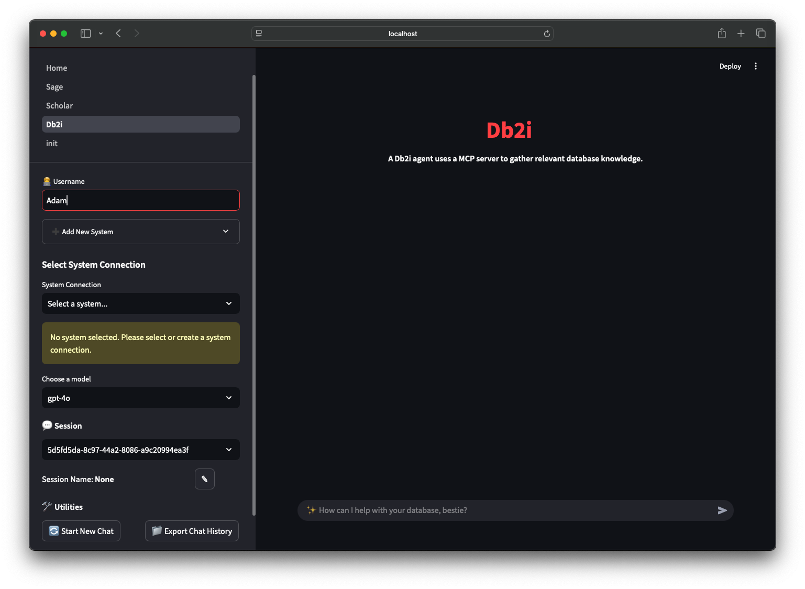
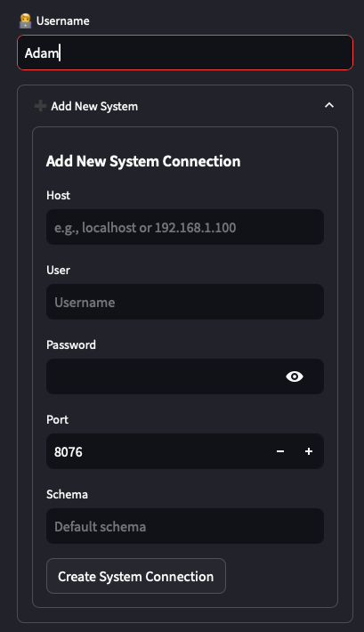
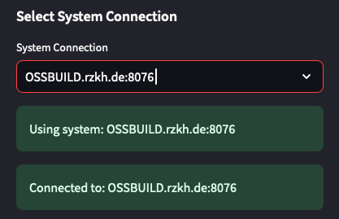
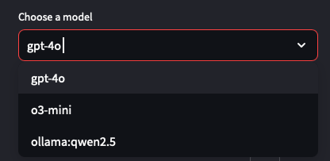
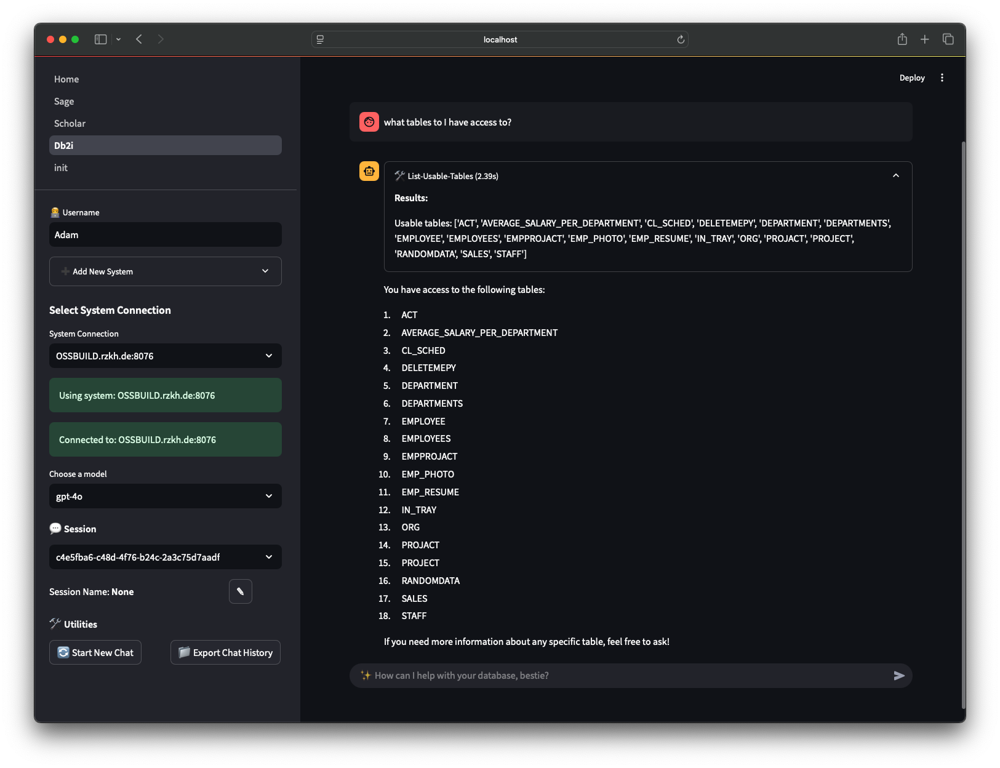
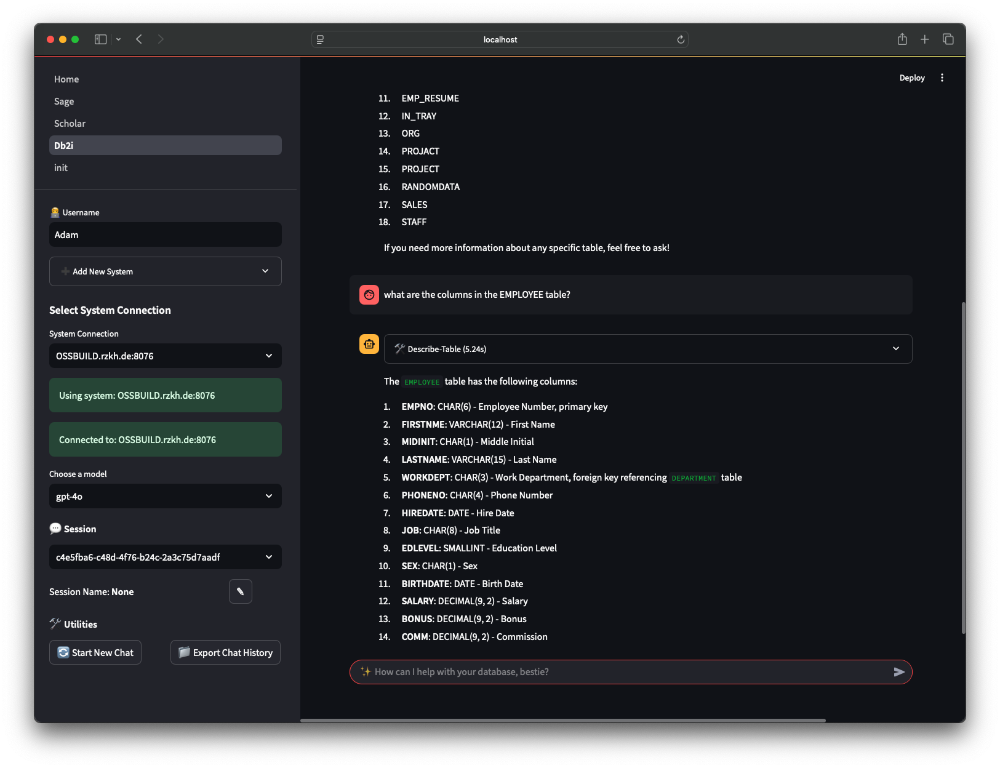
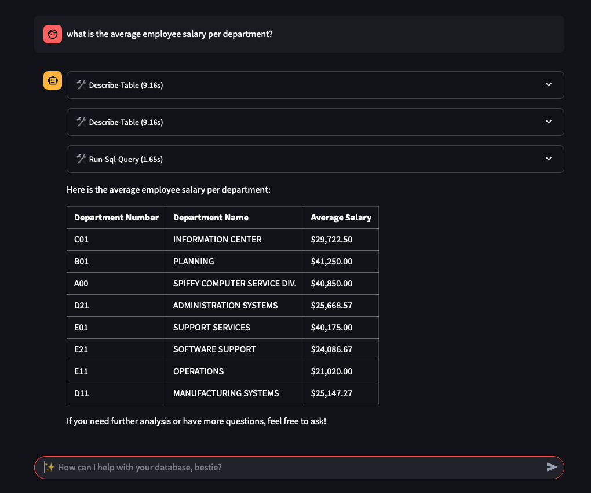
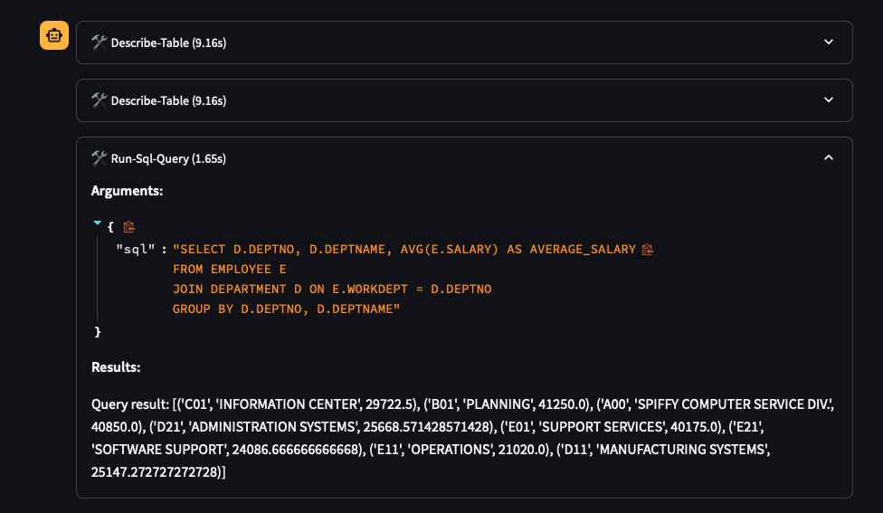

## Agent App

This repo contains the code for a production-grade agentic system built with:

1. A Streamlit UI
2. A FastAPI server
3. A Postgres database with the PgVector extension.

You can run the agent app in 2 environments:

1. A development environment running locally on docker
2. A production environment running on AWS ECS

## Agent Integration
This repo has two prebuilt agents that can be used out of the box with OpenAI: 
- `Sage`: A knowledge agent that uses Agentic RAG to deliver context-rich answers from a knowledge base.
- `Scholar`: A research agent that uses DuckDuckGo (and optionally Exa) to deliver in-depth answers about any topic.

### Custom Agents
- `Db2i` - A custom agent that can answer questions about Db2i databases.


## Setup

### 1. Install UV Package Manager

First, install `uv` for managing the Python environment:

```bash
curl -LsSf https://astral.sh/uv/install.sh | sh
```

### 2. Create Virtual Environment

Set up your development environment:

```sh
./scripts/dev_setup.sh
```

### 3. Activate Virtual Environment

Start using the newly created environment:

```sh
source .venv/bin/activate
```
---

> [!NOTE]
> **Windows Users:** If you're on Windows, follow the Windows setup guide: [Windows Setup](./WINDOWS_SETUP.md)
> 

## Run Application Locally using Docker or Podman

### 1. Install Container Runtime
- Install [Docker Desktop](https://www.docker.com/products/docker-desktop) 
- Or alternatively [Podman Desktop](https://podman.io/) if preferred

### 2. Configure API Keys

As of now, the following models are supported:
- `gpt-4o`: OpenAI
- `o3-mini`: OpenAI
- `qwen2.5`: Ollama

**Required:** Set up one of these model API endpoints:

```sh
# Option A: OpenAI
export OPENAI_API_KEY=your_key_here
```

OR

```sh
# Option B: Ollama
export OLLAMA_API_BASE=http://OLLAMA_URL:11434
```

> **Tip for local Ollama users:** When running Ollama locally, use:
> ```sh
> export OLLAMA_API_BASE="http://host.docker.internal:11434"
> ```

**Pull model for Ollama**: In a local terminal, run the following command to pull the model:
```sh
ollama pull qwen2.5:latest
```

**Optional:** Set up Exa search integration:

```sh
export EXA_API_KEY=your_key_here
```

### 3. Build and Run the Application


**Step 1:** Build container images
```sh
ag ws up --env dev --infra docker --type image --force
```

**Step 2:** Start the containers
```sh
ag ws restart --env dev --infra docker --type container
```

**What gets deployed:**
- **Streamlit UI:** [http://localhost:8501](http://localhost:8501)
- **FastAPI Backend:** [http://localhost:8000/docs](http://localhost:8000/docs)
- **Postgres Database:** localhost:5432

### 4. Stop the Application

```sh
ag ws down
```

## Db2 for i Agent

once the containers are build and running, you can access the Streamlit UI at [http://localhost:8501](http://localhost:8501)

Here is a quick overview of the UI:


### Username
- Set the username for chat session. 

### Add New System Connection
<table>
  <tr>
    <td width="400px"></td>
    <td>
      <p>Start by configuring a system</p>
      <ul>
        <li><strong>Host:</strong> Your IBM i system</li>
        <li><strong>User:</strong> IBM i user ID</li>
        <li><strong>Password:</strong> IBM i password</li>
        <li><strong>Port:</strong> Port running Mapepire</li>
        <li><strong>Schema:</strong> default schema (e.g. "SAMPLE")</li>
      </ul>
    </td>
  </tr>
</table>

Once you have configured the system connection, you can select it from the dropdown menu:


This will allow you to ask questions about the system, such as:
- "What tables are in the schema?"
- "What are the primary keys for the EMPLOYEE table?"
- "How many employees are in each department?"

> **Note:** This assumes `SAMPLE` is set as the default schema.

## Choose a Model


As of now, the following models are supported:
- `gpt-4o`: OpenAI (set `OPENAI_API_KEY`)
- `o3-mini`: OpenAI (set `OPENAI_API_KEY`)
- `qwen2.5`: Ollama (set `OLLAMA_API_BASE` to `http://host.docker.internal:11434`)

## Quick Demo


### How this works:
The following query:
```text
what tables to I have access to?
```

is sent to the agent, which has access to 3 tools for interacting with the database:
1. **list-usable-tables**: Lists all tables the user has access to.
2. **describe-table**: Describes a specific table.
3. **run-sql-query**: Runs a SQL query.

Here, the agent determines which tools calls to make based on the user input. It first calls `list-usable-tables` to get a list of tables the user has access to. This is determined from the `schema` set in the system connection.

I can then ask the agent a follow up question:
```text
what are the columns in the EMPLOYEE table?
```
The agent will then call the `describe-table` tool to get the columns in the EMPLOYEE table.


I can ask the agent to fetch some data about the employees:
```text
what is the average employee salary per department?
```
The agent will then call the `run-sql-query` tool to run the SQL query:


Lets breakdown the tools calls:
- The agent makes 2 `describe-table` calls to get the columns in the `EMPLOYEE` and `DEPARTMENT` tables.
- It then makes a `run-sql-query` call to run the SQL query which correctly joins the two tables to get the average salary per department:
  ```sql
  SELECT D.DEPTNO, D.DEPTNAME, AVG(E.SALARY) AS AVERAGE_SALARY
  FROM EMPLOYEE E
  JOIN DEPARTMENT D ON E.WORKDEPT = D.DEPTNO
  GROUP BY D.DEPTNO, D.DEPTNAME
  ```


The agent then combines the results from the 3 tool calls to generate a final answer!****


## More Information

Learn more about this application and how to customize it in the [Agno Workspaces](https://docs.agno.com/workspaces) documentation
